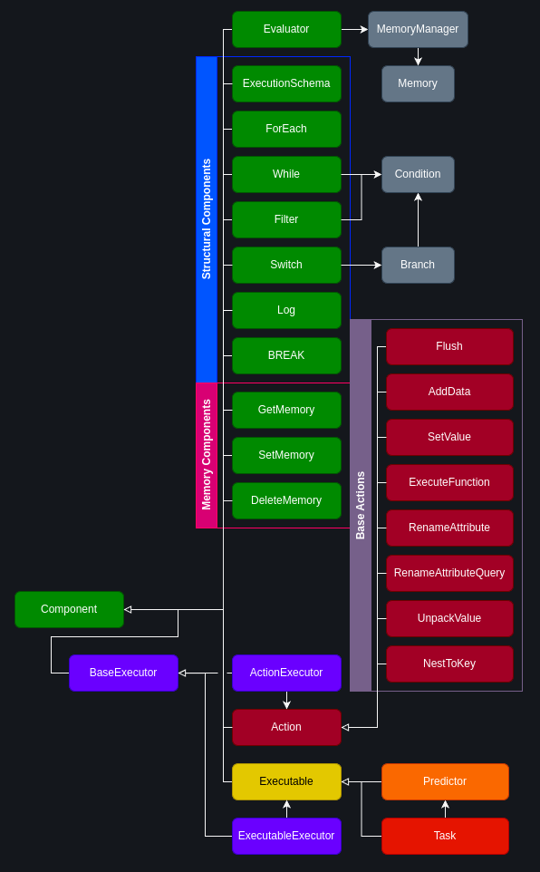

# UTCA

## Overview

UTCA is a versatile framework designed to streamline the integration of your models, as well as those sourced from Hugging Face, into complex programs. With UTCA, you can effortlessly construct intricate pipelines using pre-built components or tailor them to suit your specific requirements. The framework seamlessly supports multimodal data, offering built-in functionality for manipulating such data through a selection of pre-built components.

## Install

``` console
pip install -U utca
```

## Documentation

## Quickstart

For this example will be used simple ExecutionSchema with TokenSearcherNER task. This program will extract entities with provided labels and threshold.

To create program follow this steps:

### 1. Install package

``` console
pip install -U utca
```

### 2. Import modules that will be used

``` python
from utca.core import (
    AddData,
    RenameAttribute,
    Flush
)
from utca.implementation.predictors import (
    TokenSearcherPredictor, TokenSearcherPredictorConfig
)
from utca.implementation.tasks import (
    TokenSearcherNER,
    TokenSearcherNERPostprocessor,
)
```

### 3. Initialize components with desired configurations

#### Predictor that will be used by NER task
``` python
predictor = TokenSearcherPredictor(
    TokenSearcherPredictorConfig(
        device="cpu"
    )
)
```

#### NER task

``` python
ner_task = TokenSearcherNER(
    predictor=predictor,
    postprocess=[TokenSearcherNERPostprocessor(
        threshold=0.5
    )]
)
```

Here, we set up a task using the created predictor and define a postprocess chain with a predefined threshold.

Alternatively, we can create an NER task without describing the configuration or predictor by simply:

``` python
ner_task = TokenSearcherNER()
```

It will create a default task, which differs from the one described above only by the threshold value, which defaults to 0.

To learn more about default parameters, refer to documentation or source code.

### 4. Create ExecutionSchema

``` python
pipeline = (        
    AddData({"labels": ["scientist", "university", "city"]})         
    | ner_task
    | Flush(keys=["labels"])
    | RenameAttribute("output", "entities")
)
```

Here we described pipeline that will:
1. Add "labels" to input data with values ["scientist", "university", "city"]
2. Execute NER task
3. Remove "labels" from results
4. Rename "output" to "entities"

### 5. Run created pipeline

``` python
res = pipeline.run({
    "text": """Dr. Paul Hammond, a renowned neurologist at Johns Hopkins University, has recently published a paper in the prestigious journal "Nature Neuroscience". 
His research focuses on a rare genetic mutation, found in less than 0.01% of the population, that appears to prevent the development of Alzheimer's disease. Collaborating with researchers at the University of California, San Francisco, the team is now working to understand the mechanism by which this mutation confers its protective effect. 
Funded by the National Institutes of Health, their research could potentially open new avenues for Alzheimer's treatment."""
})
```

Here, we run pupline with input __text__.

> **_NOTE:_**  __"text"__ and __"labels"__ keys are expected by TokenSearcherNER task described above. Refer to documentation or source code.

Result should look similar to:

``` python
{
    "text": """Dr. Paul Hammond, a renowned neurologist at Johns Hopkins University, has recently published a paper in the prestigious journal "Nature Neuroscience". 
His research focuses on a rare genetic mutation, found in less than 0.01% of the population, that appears to prevent the development of Alzheimer's disease. Collaborating with researchers at the University of California, San Francisco, the team is now working to understand the mechanism by which this mutation confers its protective effect. 
Funded by the National Institutes of Health, their research could potentially open new avenues for Alzheimer's treatment.""", 
    "entities": [
        {
            "start": 4, 
            "end": 16, 
            "span": "Paul Hammond",
            "score": 0.5637074708938599, 
            "entity": "scientist"
        }, 
        {
            "start": 44, 
            "end": 68, 
            "span": "Johns Hopkins University", 
            "score": 0.8921091556549072, 
            "entity": "university"
        }, 
        {
            "start": 347, 
            "end": 371,
            "span": "University of California",
            "score": 0.7202138900756836, 
            "entity": "university"
        }, 
        {
            "start": 373, 
            "end": 386,
            "span": "San Francisco",
            "score": 0.7660449743270874, 
            "entity": "city"
        }
    ]
}
```

## Concepts

### Components

All logical blocks of programs are represented as components, each of which inherits from the base class Component. This base class encompasses essential methods and attributes required for execution, including:
* __run__:  Execute component. This method should be called when program executed.
* __\_\_or\_\___: Bound components to ExecutionSchema.
* __set_name__: Set indentification name. Usefull for debugging and logging.

For parameters and more details about Component, see documentation or source code.

### Types of components

As mentioned previously, the Component class serves as the foundational base for all components utilized in program creation. Building upon this class, there exist several primary subclasses, each assigned a distinct role. Additionally, there are specialized types of components responsible for defining the actual structure of the program. These subclasses and specialized components play crucial roles in organizing and defining the program's architecture.

#### Schema of core components



### ExecutionSchema

The ExecutionSchema is essential for organizing the execution flow in a program. 
When you call the __\_\_or\_\___ method of Component, it binds components in the ExecutionSchema to create the execution pipeline. However, if you call __\_\_or\_\___ on the ExecutionSchema directly, a Component is added to the schema. To maintain the ExecutionSchema's context, it's needed to wrap it within another Component, like another ExecutionSchema or an Evaluator.

### Context

The Evaluator manages the execution context of a program. It's either created by default, passed to the run method, or wrapped around a Component.

Evaluator oversees global memory access throughout its context. To learn more about the objects and components used to manipulate memory, refer to documentation or source code.

Additionally, the Evaluator handles logging.

### Scopes

All components manipulate the global scope of input data, which refers to the complete Dict passed as input when the run method is called. Additionally, Actions and Executables have the capability to manipulate inner scopes using ActionExecutor and ExecutableExecutor, respectively. These executors are created upon the use method call and retain the context of execution, which includes the following parameters:
* get_key (Optional[str], optional): Specifies which key value of input_data will be utilized (i.e., the scope to be used).
* set_key (Optional[str], optional): Determines which key will be used to set the result value. If set_key is set to None:
    * if the result is of type Dict[str, Any], it updates the root dict.
    * otherwise, it sets the result to the default_key. (i.e., the scope where the data is placed)
* default_key (str, optional): Denotes the default key used for results that are not of type Dict. If the data is not a Dict, a new default scope is created or used.
* replace (ReplacingScope, optional): Specifies the strategy for replacing data within the executor. It defines how and when data should be placed in the scope. Refer to documentation or source code.